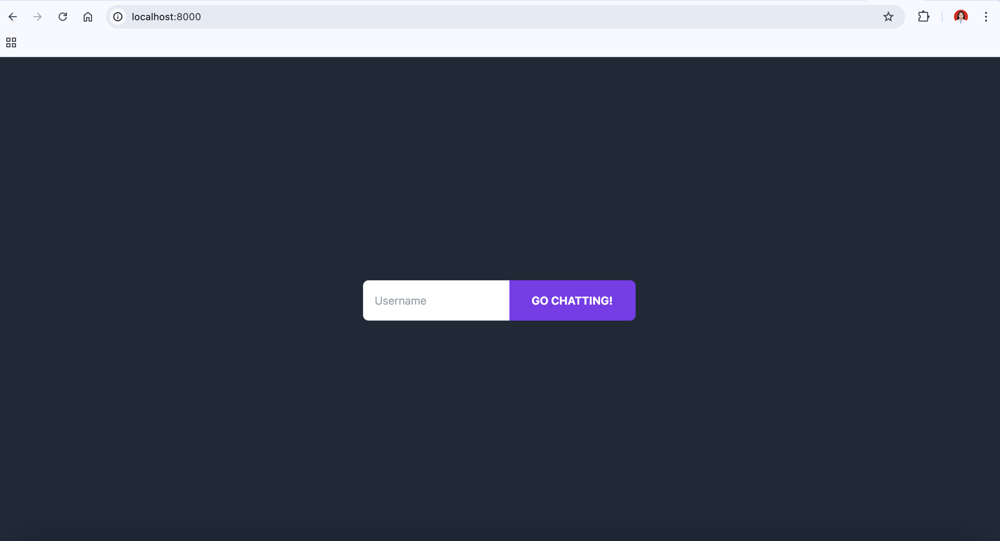
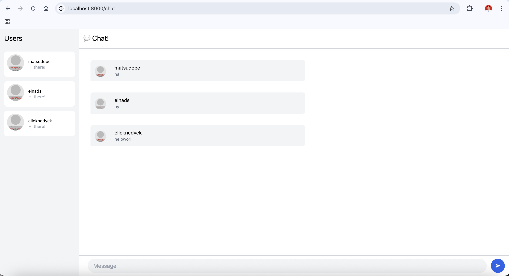
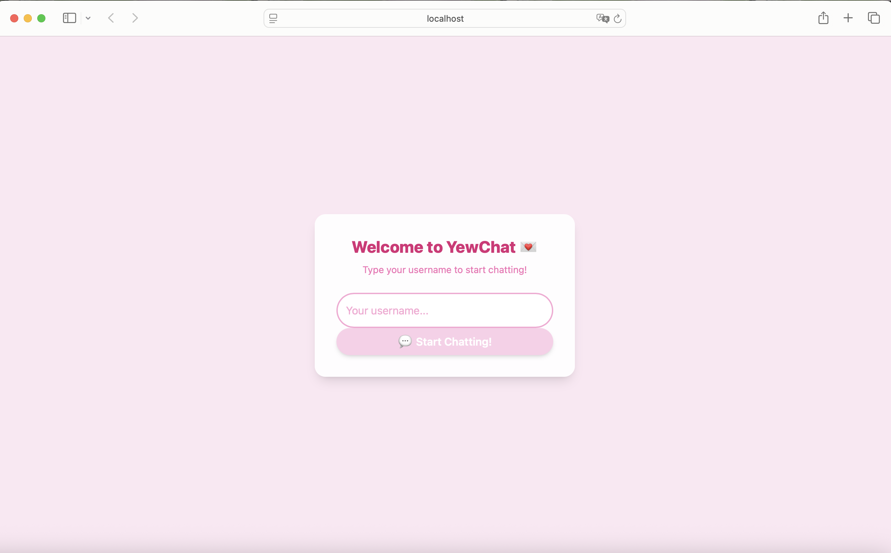
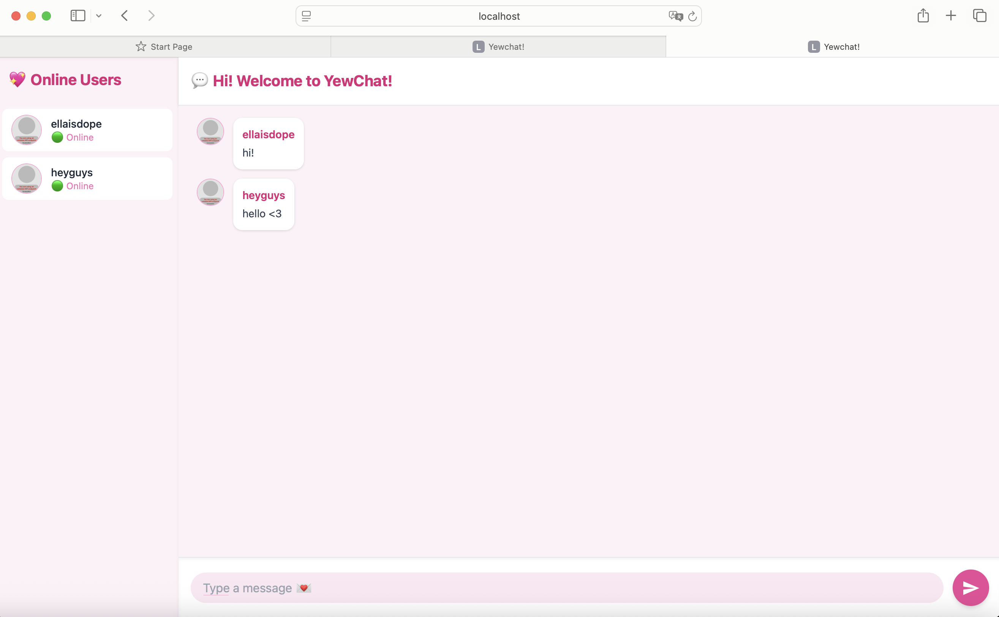

# MODULE 10 WEBCHAT ADVPROG - SAMUELLA PUTRI NADIA PAUNTU (2306170446)

## 3.1

## 3.2

NEW LOGIN PAGE

NEW CHATROOM SCREEN

For Experiment 3.2, I gave YewChat a soft pink "coquette" theme to make it look cuter and more fun. I changed the background color to pastel pink and styled the buttons, input box, and text to match. The login page has a white rounded box with a welcome message and a pink button. In the chat page, messages and user cards also use soft pink and rounded designs to keep it consistent. The goal was to make the app feel more friendly and pretty while still working the same. This creative styling shows how small visual changes can make a simple web app feel more inviting and personalized, while maintaining functionality.